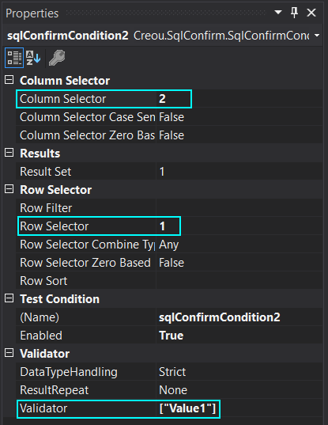
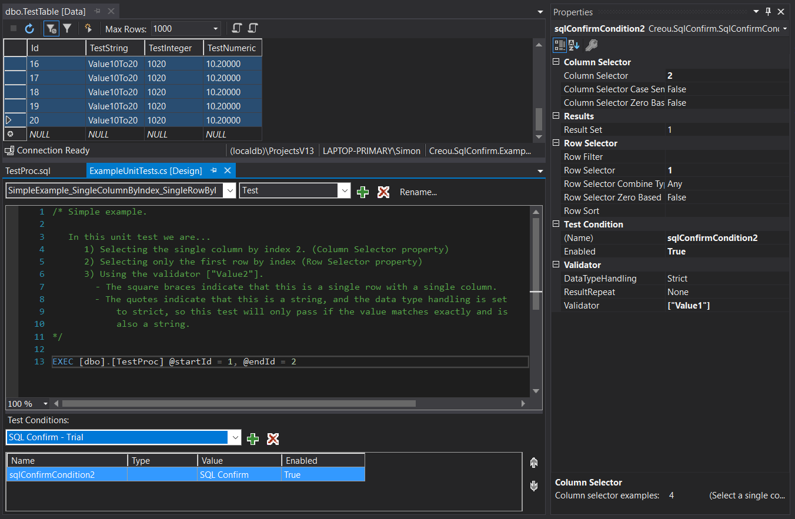

# SQL Confirm - Examples

This project contains example usage of **SQL Confirm**.

SQL Confirm is a flexible unit test condition that integrates directly with the Visual Studio SQL unit test designer.

To get SQL Confirm:

 - [buy SQL Confirm](https://gum.co/SQLConfirm)
 - Or [download SQL Confirm trial](https://goo.gl/forms/COhkjIuCTds39RPQ2)

## Example Data ##

All of the following examples are based on a database containing the follow table:

Id | TestString | TestInteger | TestNumeric
-- | ---------- | ----------- | -----------
0  | Value0     | 0           | 0.00000
1  | Value1     | 1           | 1.110000
2  | Value2     | 2           | 2.220000
3  | Value3     | 3           | 3.330000
4  | Value4     | 4           | 4.440000
5  | Value5To9  | 529         | 5.90000
6  | Value5To9  | 529         | 5.90000
7  | Value5To9  | 529         | 5.90000
8  | Value5To9  | 529         | 5.90000
9  | Value5To9  | 529         | 5.90000

There is a single stored procedure in the database called `TestProc` that takes a start and end value and returns all rows with Id's between the two values (inclusive).

    CREATE PROCEDURE [dbo].[TestProc]
    	@startId int,
    	@endId int
    AS
    	SELECT Id, TestString, TestInteger, TestNumeric 
    	FROM TestTable
    	WHERE 
    			Id >= @startId 
    		AND Id <= @endId
    
    RETURN 0

This is obviously rather a contrived example, but it is purely to give us some dummy data to use in our examples.

## Simple Examples ##

### Single column by index, single row by index ###

In this example we want to validate that a single row and column contain the value we expect. We start by calling the stored procedure and requesting rows between 1 and 2 to give us some data to validate.

    EXEC [dbo].[TestProc] @startId = 1, @endId = 2

This will return the following two result rows:

Id | TestString | TestInteger | TestNumeric
-- | ---------- | ----------- | -----------
1  | **Value1** | 1           | 1.110000
2  | Value2     | 2           | 2.220000

Let's say for example that we want to test the single value in the first row, second column matches the string "Value1".

This is done by setting the `column selector` to 2 to select the 2nd column for validation. The `row selector` is set to 1 to select the first row. (If you prefer to start your indexes from zero, there is a `row/column selector zero based` property that you can change to modify this behaviour)

Finally the validator is set to match the single value. This could be done in several ways.

Validator value | Explanation
----------------|------------
Value1          | As this could only be a string, it is fine to just enter the value directly.
"Value1"        | If you want to be more explicit, using quotes will ensure that the value is explicitly a string regardless of it's contents. This is required for strings that contain values that could possibly be other types such as "1", "1.234" or "01/02/2034"
["Value1"]      | The square brackets indicate rows. In this example we only have one row and one column so this isn't strictly necesscary, but it's good practise as it ensures the test validates the number of rows and columns as well as their contents.

As this is the first example, here is a screenshot of the whole test setup so you can get an idea of how all the pieces work together.

On the left hand side, from top to bottom, we have.

1. The data in the test database.
2. The SQL unit test design surface which contains
	a. The test query which is executing the stored procedure.
	b. The configuration of the SQL Confirm test condition.

And on the right hand side, you can see the property configuration of the selected SQL Confirm test condition.

[Copyright (c) 2017 Creou Limited.](LICENSE.md)
